# 一定要知道的5个句子

```
语法这个玩意，总是看起来很 strong 。
```

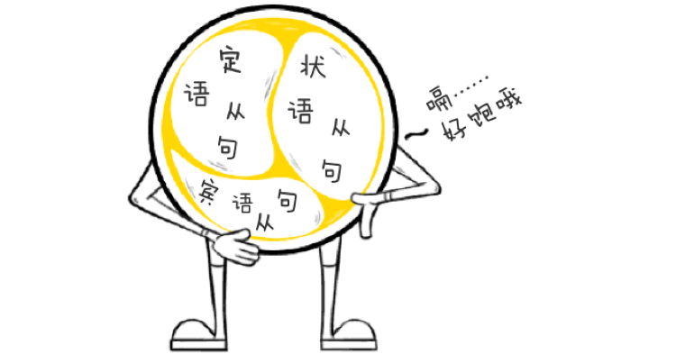

```
以至于，很多同学都被唬住了。
```

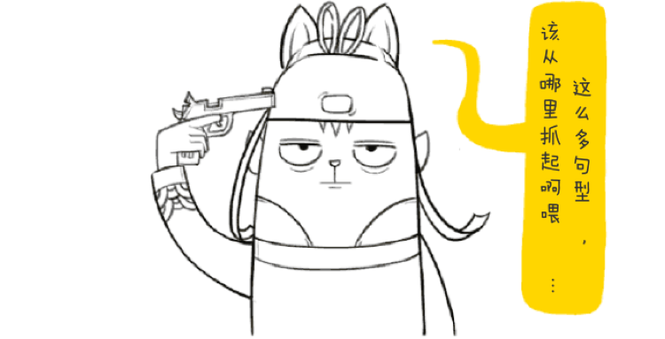

```
所以我们应该从「娃娃」抓起。
```

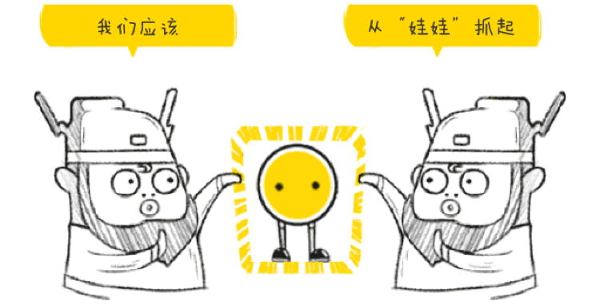

```
也就是英语句子，最原始的形态--5种简单句的基本句型
```


```
所有的复杂从句、省略句等等都是在他们的基础上，或添油加醋、或偷工减料而成的。

那他们又是打哪来的呢？

要知道，一个完整的句子，就好比一台戏，至少需要，
```

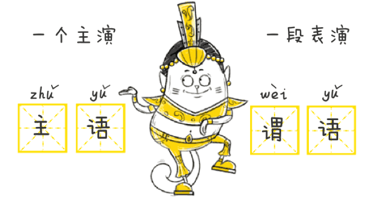

```
才能唱的起来，其中，不同的谓语，也就是不同的拿手好戏，又决定了，是否需要其他成员的加入。
```

## 主谓

```
最自力更生的句型
```


```
这个句型的拿手好戏，是一些独角戏。主语通常不带别人玩，比如，
```

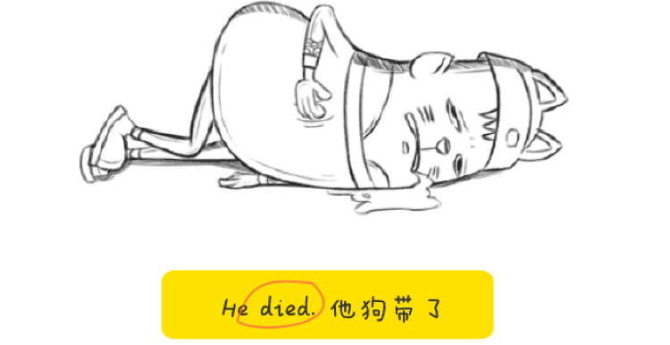

```
这种低难度动作，不需要他人配合，「主语」(he)，自个儿也可以狗带。
```

## 主谓宾

```
最祸害他人的句型
```


```
这个句型的拿手好戏，则是一些对手戏。主语最喜欢带别人玩了，比如，
```

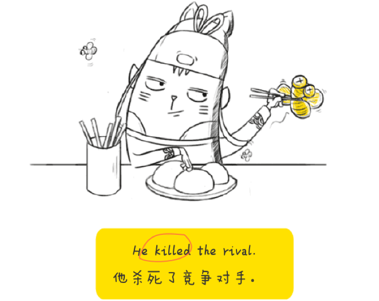

```
例句中的「谓语动词」是(kill)，杀，「主语」(he)，得有个被杀的对象，才算完整。而这个对象，我们就叫它「宾语」。
```

## 主谓补

```
最会搞关系的句型
```


```
如果说，有什么句型，看起来啥都没干，但仍然颇有人气的话，那一定是「主+谓+补」句型，也就是同学们熟悉的「主+系+表」。他的拿手好戏非常特殊，是个系动词，比如is（是），look（看起来是）等等，
```

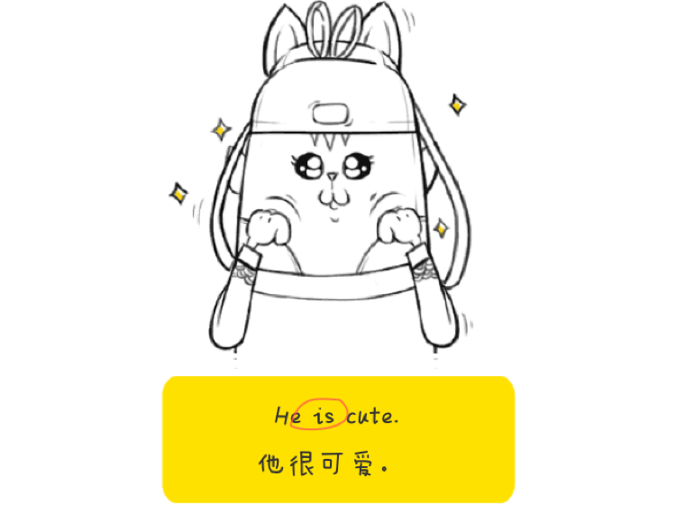

```
属于没什么大动作，但可以用来搞好关系的 谓语动词。它和谁搞好关系呢？自然是，最擅长搞气氛的 补语 们了。补语，说白了，就是一群托儿，擅长各种吹捧追杀。
```

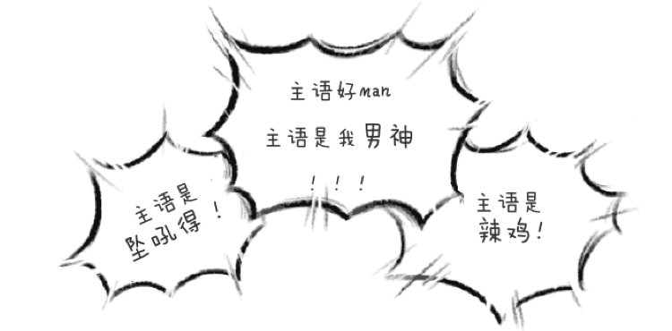

## 主谓宾宾

## 主谓宾补

```
搞定了这3个句型，剩下2个就很好理解了。
```

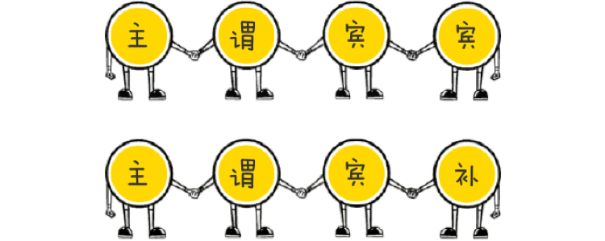

```
这俩句型没啥本质区别，都属于，不满足于只演对手戏，还想来点道具呀、托儿呀什么的。就拿这场戏来说吧。
```

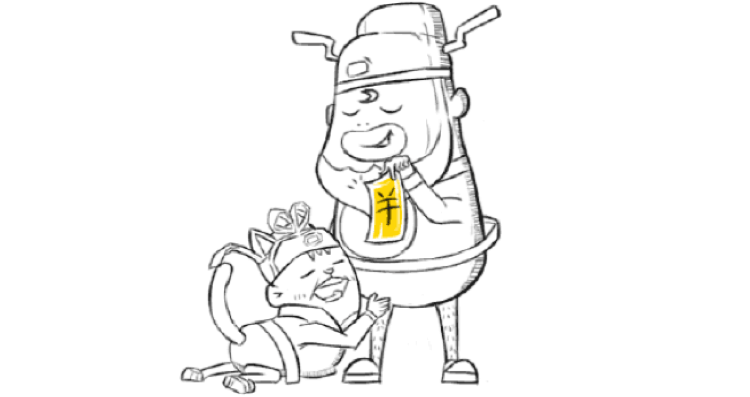

```
只说 lent me ，借我，是不完整的，还得有借我了什么东西，这个“东西”，就是第二个 宾语 。而到了这个句子里，
```

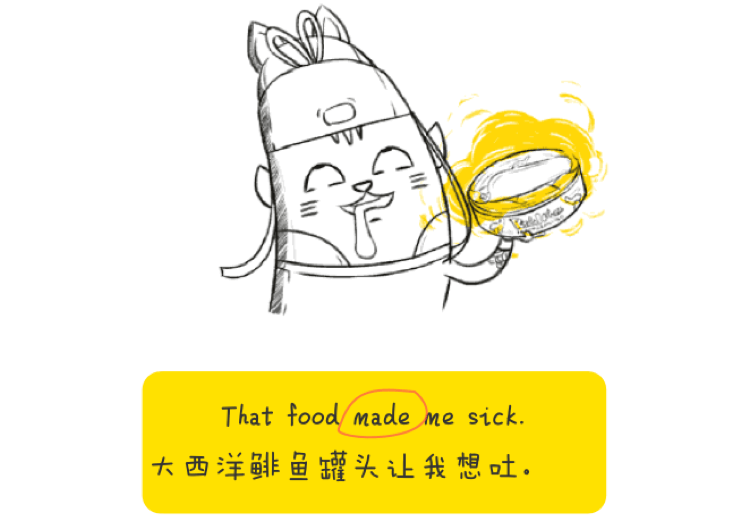

```
只说 made me，让我，也是不完整的，总得让我怎么着了吧，因此，我们就得带上个 补语 ，来说 宾语me 怎么着了。这5个句型，同学们不用死记。每个句型的拿手好戏不一样，构造自然也跟着不一样。
```

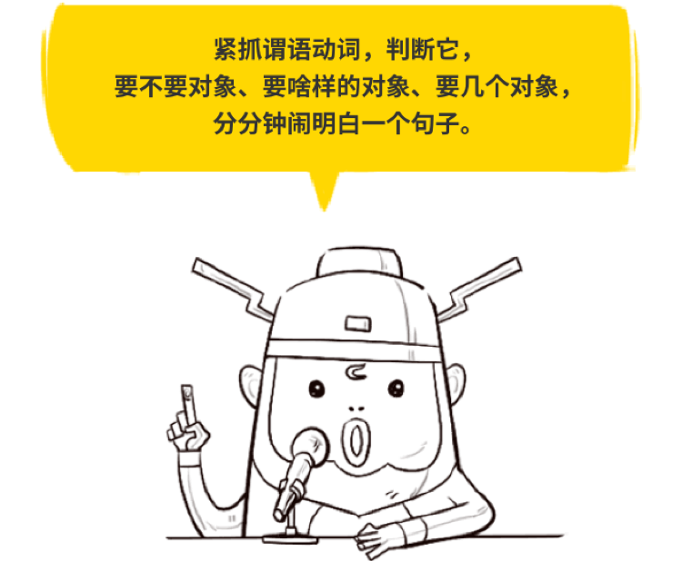