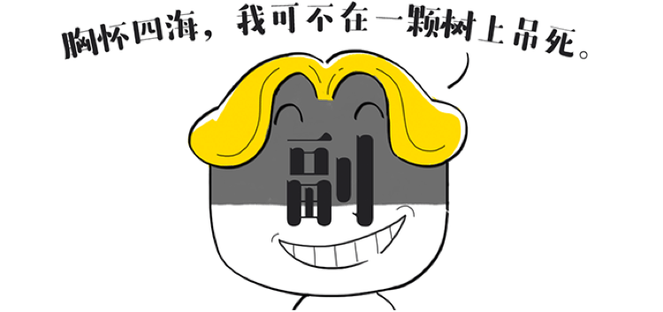
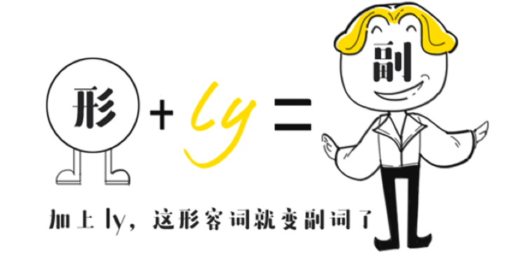
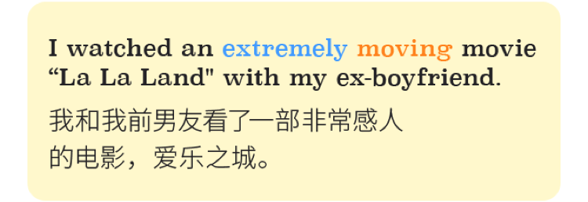
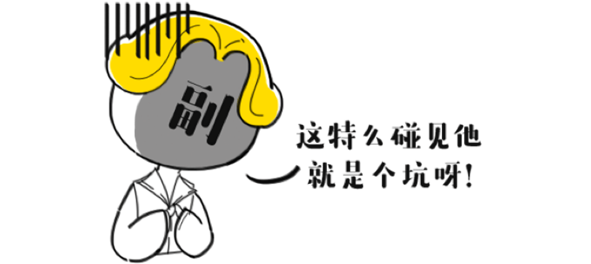
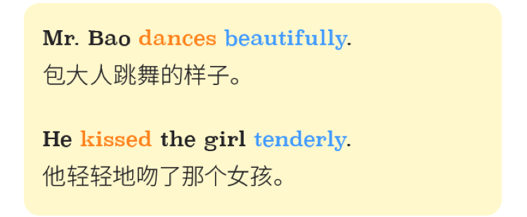
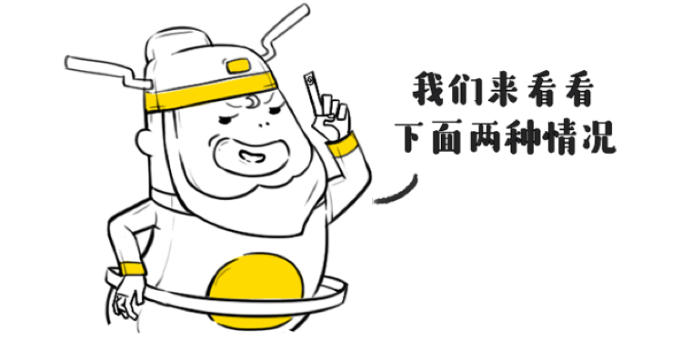
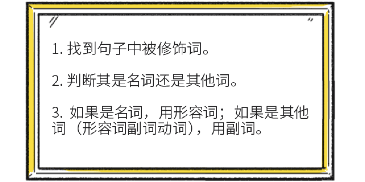

# 花心的副词

```
这一次要来了解一下形容词的大兄弟副词。
```



```
如果说中文的形容词是「...的」; 那么副词就是「...地」。
```

```
在英语中，这 副词 按 构词法大约分为两类：

「 一类是形容词+ly的派生词， 如，recently，politely，carefully等； 」，
```



```
「 另一类是不+ly的， （有些词跟它的形容词还长得一模一样 如，late，fast，hard） 」
```


```
看起来亲密无间，但是古人云，
```


```
这形容词和副词都有修饰功能， 那怎么分配呢？ 上次说， 形容词是情种，独爱名词， 那，其余的... ...
```


```
你没看错， 除了动词，介词，连词，限定词， 包括形容词， 就连同类副词也不放过...... 我们今天来讲讲 形容词，副词，动词这三大类吧。
```

## 副词和形容词




```
副词修饰形容词时， 形容词要让大胸弟在前。
```


```
副词和副词在一起的时候， 修饰的那个在前。

注意：唯有enough这个副词，必须后置
```

## 副词和动词


```
动词，是个大佬， 在语法界叱咤风云， 不是当谓语，就是当非谓语，
```



```
所以，跟动词一起， 副词就会有两种情况。
```


```
通常情况， 副词 放在 动词 后面当小跟班， 做他身后的男人
```



```
这里 tenderly 放在了 girl 的后面， girl 是 宾语，宾语 肯定也很重要啦， 所以 副词 tenderly 就再往后面站！ 但是，在背后的男人， 也总会有在人前的时候。
```



1.一般情况放在 动词 后面， 但是如果放后面有歧义， 那 副词 就要放在 动词 前面。 我们把刚才的句子变了一下：


```
读这个句子时， 可能会懵逼， 因为这里到底 tenderly 是修饰 living 还是 kissed 呢？ 所以，这个时候副词要放在动词前面：
```


```
紧紧挨在一起！ 这样就不会误会了！
```

2.如果修饰的副词表现语气很强烈，那就要放在动词前


```
这样的副词还有 only/ merely/ also/ especially/ even/ particularly/ utterly/ almost/ surely 等等
```

```
我们总结出解决这类问题的三步骤
```

