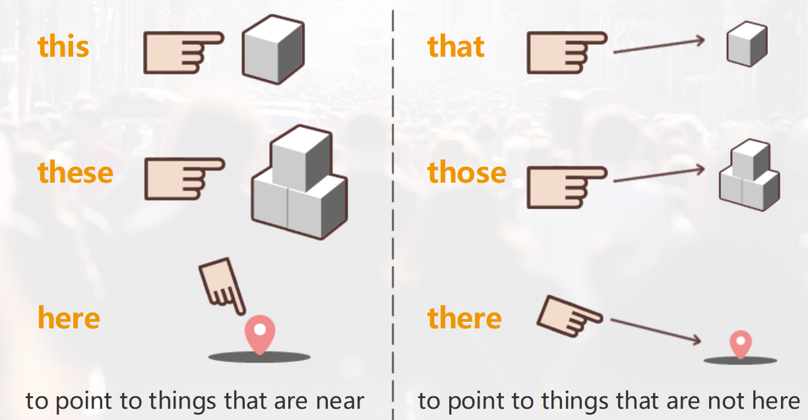
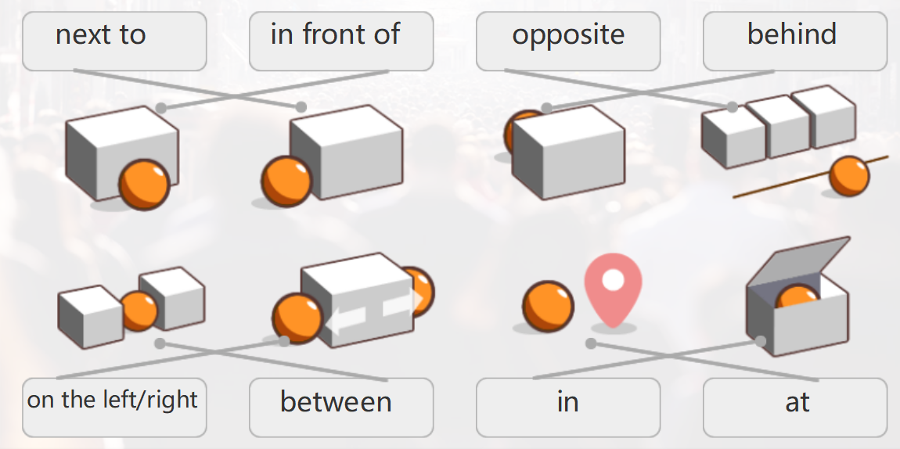

# Episode1

**Direction words**



句子

```
1.Where is this?
2.What are these red circles?
3.The blue one here and the yellow one there
4.Yes,that's a good example
5.Those cities have a lot of important places
6.The economy is good here
```

```
1. Where can you find lots of books?
2. Where can you buy food?
3. Where can you put your money?
4. Where can you go for a walk?
```

```
1. Where's the supermarket? Is it near the bank?
Yes, it's behind the bank.

2. Is there a hotel near here?
Yes. There's one next to the train station.

3. Where's the Blue Mosque? Is it in Cairo?
No. It's in the old town of Istanbul.

4. Excuse me, where's the library?
It's opposite the restaurant on Tower Street.

5. I can't find the restaurant – is it near here?
Yes, it's between the bank and the bookshop.

6. Where's the train station?
It's in front of that big clock. There – on the right.

7. Where can I get a bus?
At the bus stop over there. Can you see it?

8. I'm looking for the park. Is it near the bridge?
No. It's there on the left. It's behind that school.
```

**Prepositions of place**



# Episode2

`Listen1:A`

```
Kerry: … OK then, so we're at the clock and that means it's the end of today's tour of the university campus. So, any questions? No? OK, so can you remember – what are we going to do now? Faisal?

Faisal: Um, take a quiz? About the places in the university?

Kerry: Yes, that's right!

Students: [groaning]

Kerry: Oh, come on, guys! There's a lot of information in your first week at university. I don't want you to get lost! OK, so, Faisal, Takashi and Abdullah – you're Team A. And Akira, Katsuo and Ahmed – you're Team B. Now – I ask the questions, and you get one point for a correct answer. OK?

Students: Yes. / Yes. / Yeah.

Kerry: Right then. Question one. Where's the train station? Yes! Katsuo!

Katsuo: It's opposite the International Business School.

Kerry: OK, and how do I get there from here?

Katsuo: Go along Leeds Street …

Kerry: Uh-huh.

Katsuo: Then go over the bridge.

Kerry: Excellent! One point to Team B. OK, two. How do I get to the supermarket from here? Yes! Ahmed.

Ahmed: Em, OK, you can go along South Road and then turn left.

Kerry: Turn left where?

Ahmed: At the Chemistry building on Kroto Street. Go along Kroto Street and over the bridge on Canal Street. The supermarket is on the right, next to the bus station.

Kerry: Perfect! Another point to Team B. Right then. Next question. Can you tell me the way to the library? Yes! Takashi!

Takashi: Yes, go through Clock Tower Garden to the Student's Union. Then turn right …

Kerry: Uh-huh.

Takashi: … then turn left. The university library is behind the student's union on Park Street West.

Kerry: Is that East or West?

Takashi: West.

Kerry: Correct! You guys are brilliant. OK, now. Four. Is there a bank near here?

Faisal: Yes!

Kerry: OK, Faisal.

Faisal: It's behind the Business School. Go along Leeds Street and then turn left. Go along Hospital Road and turn left. There are three buildings on York Street. The bank is next to the café and opposite the gym on South Road.

Kerry: Great! That's right. OK, Five. Where's the Physics…
```

`Listen2B`

```
Lecturer: Now, today I want to talk about megaregions. We're going to look at megaregions in different parts of the world, but first, we're going to look at this. Now, I have a map here. Where is this? Yes, Mehmet?

Mehmet: Europe. It's Europe at night.

Lecturer: Yes, yes, that's right. OK, so look at the map now. What are these red circles? Belis, yes.

Belis: Are they cities? I think that one's Istanbul. There, at 'G'.

Lecturer: Yes, that's right. These are big cities. Um, here we have London at 'A', then here at 'C' is Paris and that one there at 'D' is Madrid. OK, now you see these two lines? The blue one here and the yellow one there? These show megaregions. Now, what does 'mega' mean?

Belis: Um, mega means 'big', 'very big'.

Lecturer: Yes, that's right. Thank you, Belis. So can you give me an example of a megacity?

Mehmet: Istanbul.

Lecturer: Yes, Istanbul.

Mehmet: Er, Shanghai.

Lecturer: Yes, that's a good example. OK, so a megacity is a big city but a megaregion is a group of important cities. They're important for business and they're important because a lot of people live there. We sometimes call this blue line here the 'blue banana'. It's the name for a group of cities that go from north to south in Europe. Those cities have a lot of important places. For example, ports, airports and big banks. Rotterdam is a good example. The economy is good here. That's at 'B', here on the map. It has a very busy port. This yellow line that goes from East to West is another megaregion. It's also …
```

# Episode3

Ask for directions 

```
Where's the gym?
Is there a café near here?
How do I get to the Language Centre?
Can you tell me the way to the train station?
I'm looking for the library. Is it near here?
```

```
Excuse me! Can you tell me the way to the train station, please?
Excuse me! I think I'm lost. Is there a café near here?
Excuse me! How do I get to the Language Centre?
```

```
1. It's opposite the International Business School.
2. It's in the old town of Istanbul.
3. Go through Clock Tower Garden to the Student's Union.
4. It's in front of that big clock. There – on the right. 
5. OK then, so we're at the clock.
6. Go along Leeds Street. Then go over the bridge. 
7. There's one next to the train station. 
8. It's there on the left. It's behind that school. 
```

```
It's behind the International Business School. Go along Leeds Street and then turn left. Go along Hospital Road and turn left. There are three buildings on York Street. The bank is next to the café and opposite the gym on South Road.
```

```
Go out of the square and turn left. Go along Racer Street and up the hill to the castle. Go around the castle and down Fort Street to the river, and then go over the bridge. Go across the road and through the park to a big tree. When you are under the tree, turn right and go into the tent.
```

# Episode4

Noun phrases with of:

```
· I can see the fountain of the park.
· He knows a museum of England history.
· Abdullah studies in the university of Cairo.
· A large monument is in the centre of our school. 
· The train station is in the south of the city.
```

there is / there are

```
To say that something exists: there is / there are

there is: before singular nouns
· There is a bank in the city.
· There is a fountain in the park.

there are: before plural nouns
· There are many trees in a forest.
· There are farms and hills in the countryside. 
```

```
Muhammad Al-Idrisi came from Morocco. In his life, Al-Idrisi travelled to Asia, France, England and Spain.

Al-Idrisi's map of the world is called the Tabula Rogeriana in Europe. The map is in Arabic. His map helped people travel from country to country.

The map shows North Africa, Europe, and South and East Asia. There are many European countries on the map. There is Norway in the north, Spain in the west, and Italy in the south. His map also shows India and China.

There are forests, rivers, lakes, mountains, seas and oceans on the map. Al-Idrisi's map shows the Mediterranean Sea, the Indian Ocean and the river Nile.
```

# Episode5

MEET THE LOCALS

```
Ahmed Faiz, 19
I live on an island south of Malé. Life on my island is very simple. 
There are some shops and one mosque. We speak Dhivehi, but we 
also learn English in high school.

The Maldives are famous for their fish. The most popular food here 
is garudiya. It's a delicious fish soup. 

People in the Maldives like to swim and dive.
```

The Maldives — AN OVERVIEW

```
The Maldives are islands in the Indian Ocean. The islands are near 
Sri Lanka. The Maldives are famous for their good climate, beautiful 
beaches and warm seas. 

There are 360,000 people in the Maldives. Most people live on small 
islands.

The capital city of the Maldives is Malé. It is a modern city with an 
international airport and a big harbour. 

People in Malé speak English and Dhivehi. English is useful because 
many tourists come here. 

Tourism and fishing are the most important businesses in the Maldives. 
Many people work in tourist resorts. Others work as fishermen or in fish 
factories. The currency is the rufiyaa. 
```

# Episode6

```
The climate is good in the Maldives.
Abdulla and I are university students.
```

```
There are four main islands in Japan.
There are many beautiful fountains in Rome.
The Maldives are islands in the Indian Ocean.
My sister is in the United Arab Emirates.
```

We use the before the names of:

```
· rivers   (the river Nile; the river Thames; the Yellow River)
· seas     (the North Sea; the Black Sea; the Mediterranean Sea)
· oceans   (the Pacific Ocean; the Atlantic Ocean; the Indian Ocean)
· famous places   (the Galata Tower)
· "united countries"   (the United Kingdom; the United Arab Emirates)
· groups of islands    (the Maldives; the Philippines)
· groups of mountains  (the Alps; the Himalayas)
```

We use no article (the zero article) before the names of:

```
· continents (Asia; America; Europe)
· countries (China; Turkey; Chile)
· cities (Abu Dhabi; Bangkok; Shanghai)
```

Writing Task

```
Hello, Abdullah! How is everything going?

Now I am in the Maldives. This is a beautiful country. The Maldives 
is in the Indian Ocean. The capital city is Malé. There are 360,000 
people and many islands in this country.

I eat a lot of fish here. The famous fish soup is garudiya. It is very 
delicious. The weather is hot and sunny, about 30℃.

People in the Maldives speak Dhivehi and English. I don't know 
Dhivehi, but Echo helps me talk with people in English.

The scenery is very nice. I think you like it, too.
```
