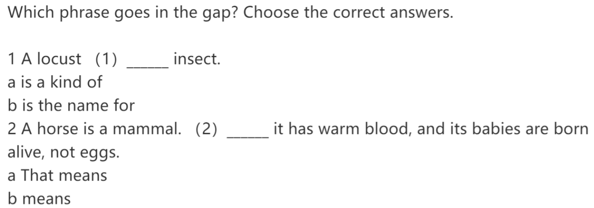
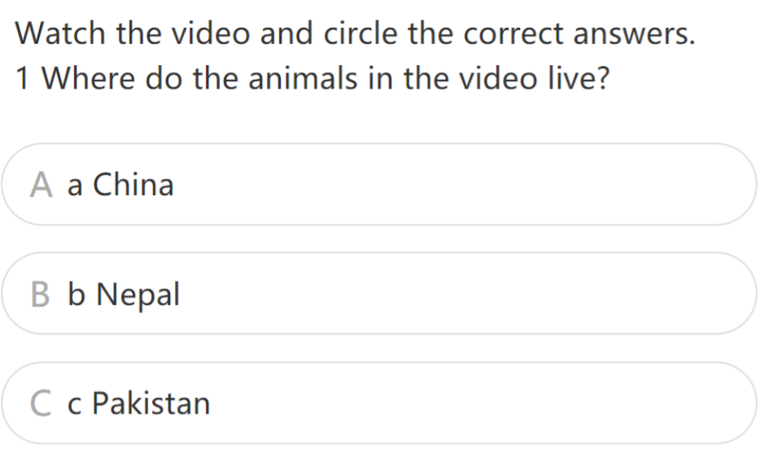
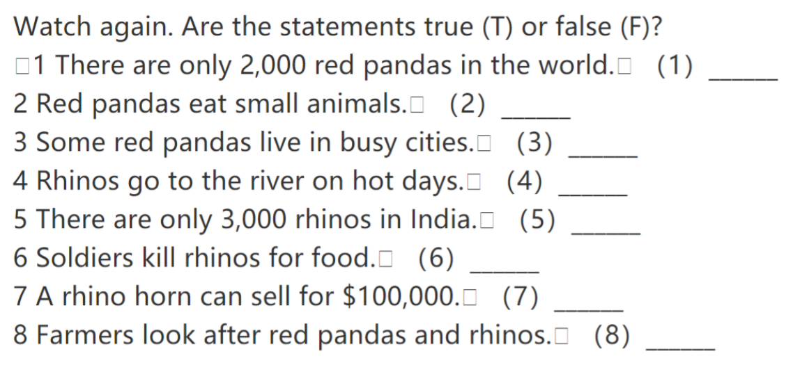
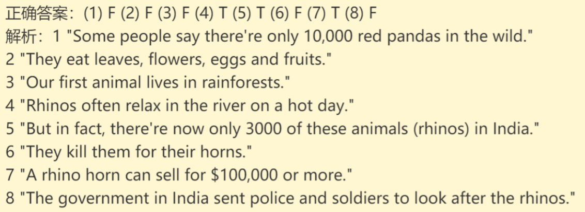
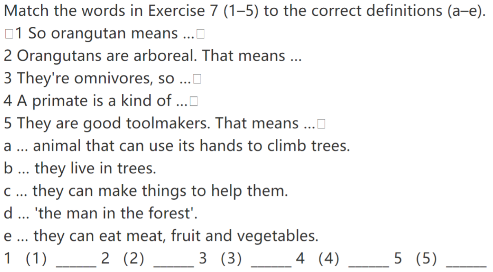

# Episode1

```
Bears, lions and cats are mammals.
Bears and lions are hunters.
A lion is a kind of wild cat.
A whale and a fish are kinds of sea creature.
```

```
This animal is a kind of reptile. They live 
in the deserts in the Arab world.

They live in 'burrows'. That means a hole 
in the ground. They eat plants and small 
insects.
```

```
This animal is a kind of insect. They are 
small and yellow or green. They live in 
Africa, the Arab world or Asia. They travel 
in large groups called a 'swarm'. There are 
millions of these insects in each swarm.
```

`习题A`




正确答案:(1)a(2)a(3)a(4)b(5)b

`习题B`




`习题C`





# Episode2

```
Presenter: In half an hour, in 'Technology Today', we look at hovercraft in Alaska. But first, here's Kate Brand in our series on the animal world. In this week's 'Going Wild', Kate travels to Indonesia to meet some very special animals.

Kate: Now, it's noisy today because I'm in a jungle. I'm in the jungle in West Sumatra in Indonesia, and I'm here with Zaskia Basuki. Zaskia is a scientist and she knows a lot about the animal we're here to see today – the orangutan. So, Zaskia, what can you tell us?

Zaskia: Well, Kate, let me start with the name. In Indonesia and Malaysia, the word orang means 'man', and the word hutan means 'forest'. So 'orangutan' means 'the man in the forest'.

Kate: I see!

Zaskia: It's a good name for them, because orangutans are 'arboreal'. That means they live in trees. Here in Sumatra, they only walk on the ground when they have to. In fact, 90% of their life is in the trees. They're omnivores, so they can eat meat, fruit and vegetables, but they usually eat fruit. They're primates so—

Kate: Sorry, Zaskia ...

Zaskia: No, no, that's OK.

Kate: For the listeners at home, can you just explain 'primate'?
Zaskia: Ah, yes, well, a primate is a kind of animal that can use its hands to climb trees. Primates usually have a big brain, too.

Kate: Really? So are orangutans clever?

Zaskia: Yes, yes, they are very clever. They are good toolmakers. That means they can make things to help them. For example, they can use sticks to find food or leaves to make an umbrella. There's a famous video of one orangutan in the rain. He's very wet, so he uses some leaves to make a big umbrella.

Kate: That's great!

Zaskia: Yes, so they …
```

```
What do you know about orangutans?
1. What do they look like? 
     (Are they big animals?)
2. What do they eat?
3. Where do they live?
```

`习题A`


正确答案:(1)3(2)2(3)4(4)1

`习题B`



正确答案:(1)d(2)b(3)e(4)a(5)c

# Episode3

```
Where do these animals live?
What do they eat?
```

```
Jason: Hi! How are you today? Good? Good! OK, good morning! I'm Jason, and today I'm going to tell you about a bird from my country – the American bald eagle. OK, so, where do they live? Well, you can see them in the US and Canada and here's a photograph of one.You can see here that this bird is flying to its nest. 'Nest' is the name for the place where the eagle lives. Some nests can be very big. How big can they be? Well, there was one eagle's nest that was more than 1,000 kilos!Here's another photograph. You can see she has these white feathers on her head.So what do bald eagles eat? Well, fish are their prey. That means the eagles hunt them. And you see her yellow beak here? That beak is very sharp. That means it can cut the fish very easily.OK, uh, and now Khaled is going to talk about an animal from his country.
Khaled: OK, good morning, everybody. My name's Khaled and I'm going to talk about the animal in this photograph here. So this is an Arabian oryx.An oryx is a kind of wild animal that lives in the desert. You can see them in many countries in the Arab world. For example, Oman, Jordan, Saudi Arabia and near my home in Abu Dhabi.They are famous for their horns. That's these two long, hard things on their head. You can see their horns better in this photograph. The horns are very sharp!Oryx can run and jump very fast. Oryx eat grass and also fruit when they can find it.The oryx are nomadic. That means they do not live in one place in the desert, but they travel around.Thank you! Now, I think …
```

```
OK, hello, everybody. My name's Luo Yan, and I'm going to talk about 
brown bears. This is a photograph of a brown bear. So, where do these 
bears live? Well, they live in forests and near rivers. They often live in 
mountains.And where can you see brown bears? In a lot of countries! Brown bears 
live in America and Europe and parts of Asia.How do they live? Well, they sleep for the winter and they hunt in the 
summer. They have to eat a lot in the summer, so bears are often hungry.And so what do they eat? Well, they eat a lot of different things. They like 
fruit, fish, vegetables, nuts and grass.So why are they special? Well, they are very, very strong animals. They can 
move rocks and trees and other big things easily.
```

# Episode4

```
Tigers are an endangered 
species. 

People do not like snakes but 
many of them are harmless. 

Bats are nocturnal animals. 
They hunt at night. 

Frogs are amphibious.
They can live on land and in water. 
```

```
· Sailfish can swim at 109 kph.
· They can live in very cold and very hot places.
· It is a bird but it cannot fly.
```

```
Leopards can run at about 
60 kph.
An average elephant weighs 
about 5,500kg.
A wolf's body is usually from 
90cm to 160 cm long.
Zebras are about 120 ~ 130 
cm high.
```

```
Bats live on small insects.
Kangaroos live in Australia.
Bears can live for 25 to 30 
years.
Eagles can fly at more than 
75 kph.
```

```
Bears can swim and they catch fish in rivers.
Lions hunt zebras. Tigers look for their prey in jungles.
Squid live in the sea and have ten long arms.
```

```
Redback spiders live on small insects.
live on: 以……为生
live on small insects 以小昆虫为食

Female redback spiders live for two or three years.
live for: 寿命……
live for two or three years 寿命为2~3年
```

# Episode5

```
small→ the smallest   · The smallest animal in the world lives in Asia.
strong→ the strongest  · Many of the strongest animals in the world live in Australia. 
```

```
· Dolphins are the friendliest animal in the sea.
```

```
 · The most poisonous frog on earth lives in South America. 
```

```
 · The most endangered type of bear is the panda bear.
```

```
· The smallest animal in the world lives in Asia.
```

# Episode6

```
Cheetahs (Acinonyx jubatus) are the fastest animals on land.They can run at 112 kph. They are smaller than lions and leopards. The average cheetah is 66 cm to 99 cm high and weighs between 35 and 72 kg. Cheetahs live for about 12 years. Female cheetahs usually look after their cubs alone. They usually have between two and four cubs.

Cheetahs use their speed to catch their prey. They hunt gazelles and zebras. In the past, cheetahs lived in Asia, the Middle East and Africa. Now, most cheetahs live in East Africa but there are a small number of cheetahs in Iran.

Sharks may be the most dangerous animal in the sea, but they are not the fastest swimmers. The fastest swimmers are sailfish. There are two kinds of sailfish. Atlantic sailfish (Istiophorus albicans) live in the Atlantic Ocean, and Indo-Pacific sailfish (Istiophorus platypterus) live in the Indian Ocean and the Pacific Ocean.
Sailfish can swim at 109 kph. Sailfish hunt other fish and squid. They often hunt in groups. The biggest sailfish are 3 m long and weigh 90 kg. The average sailfish is usually smaller than this. They live for about four years.

Peregrine falcons (Falco peregrinus) are the fastest birds on earth. They usually fly at 65~90 kph but they can fly faster when they hunt. Their highest speed is about 325 kph. They hunt other birds – usually ducks and pigeons. Their wings are about 120 cm long. Their body is about 34~58 cm long. They weigh about 1 kg.

You can see peregrine falcons in most countries. They can live in very cold and very hot places. They live for about 15 years.
```

```
Introduction There are about 10 million different kinds of animal on earth and they come in all shapes and sizes. This book is a simple introduction to the huge variety in the animal kingdom. It features some of the most unusual animals in the world and includes key data on each species and their habits in the wild.

Some of the strangest animals in the world live in Australia and New Zealand. There is the kakapo parrot (Strigops habroptila). It is a bird but it cannot fly. It is a nocturnal animal. It sleeps in the day and eats at night. There are only 131 kakapo parrots in the world.

The kiwi (Apteryx australis) is another bird that cannot fly. Some birds are very beautiful – but the kiwi is not. It is one of the ugliest birds in the world. But the kiwi is the most romantic bird in the world. Male and female kiwis live together for 30 years.

Australia has many strange animals. The most surprising Australian animal is the platypus (Ornithorhynchus anatinus). It has the face and feet of a bird, the body of a rat and the tail of a beaver. It is a mammal but it lays eggs.

The smallest mammal in the world lives in Asia. It is the bumblebee bat (Craseonycteris thonglongyai). It lives in Thailand. It is only 2.5 cm long and it weighs 3 g. There are only 2,000 bumblebee bats left in Thailand because people burn the forest where they live.
```
