# 如何用介词in/on/at表示位置

```
要搞明白介词，我们就先知道介词是什么？
```

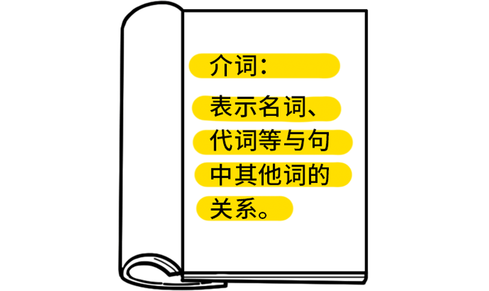

```
看起来十分的抽象，我们可以用中文举个例子。
```

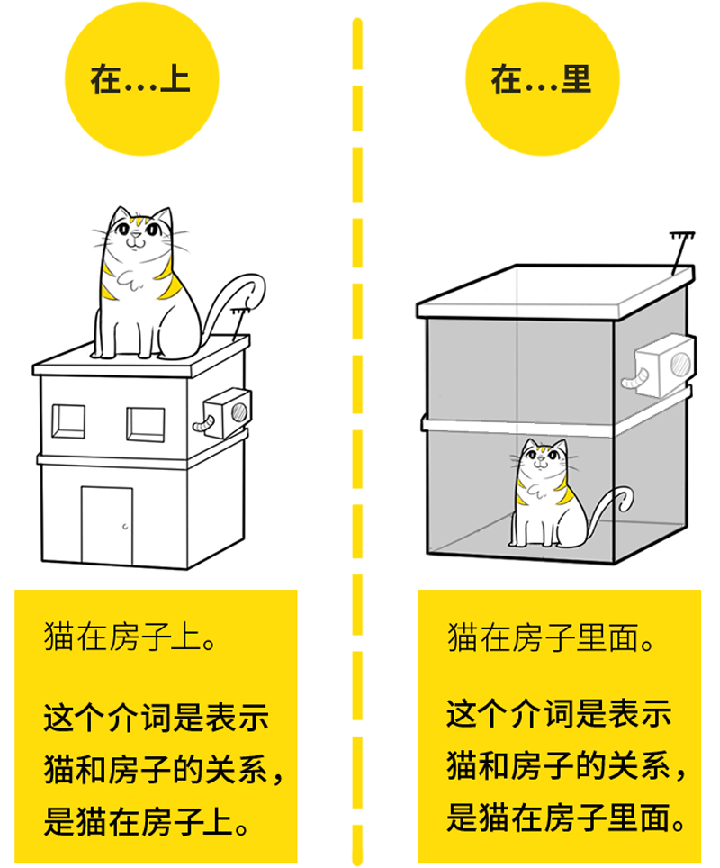

```
回想一下， 我们在学习中文的时候， 可没有死记硬背什么 介词 固定搭配， 在房子上或者在房子里。

为什么呢？ 大家都知道， 因为我们理解了中文的内在含义。

那怎么理解这些英文介词的内在含义呢？

今天先讲表示位置的in/on/at。
```


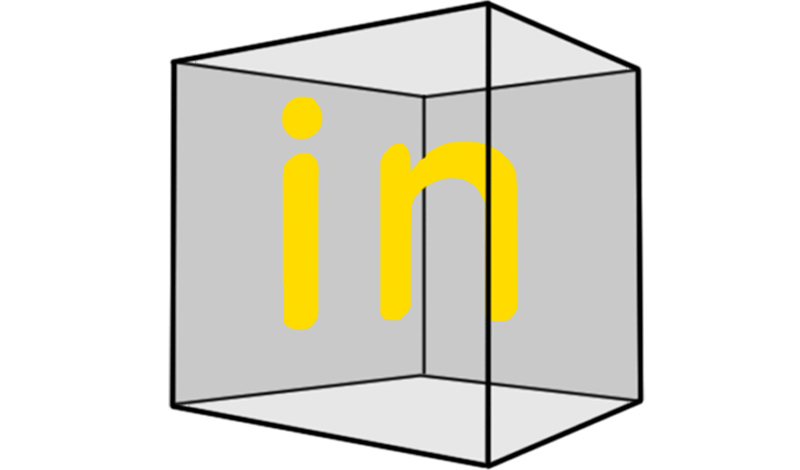

## In

```
in表示在里面， 强调在其的内部。
```

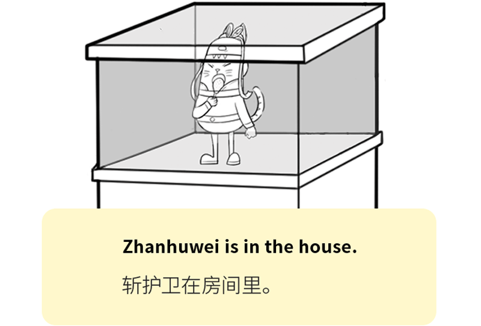

```
(斩护卫对于房间，他是在房间的里面。)
```


```
(鸡腿对于嘴，鸡腿在嘴的里面。)
```

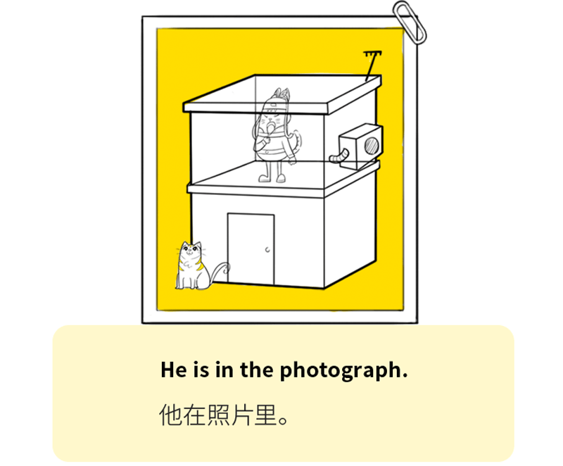

```
( 虽然照片是平面，但是人是和照片融为一体的。 )
```


```
in是强调事物被包含在内部。
```

## On


```
on表示在上面， 强调在平面上。
```

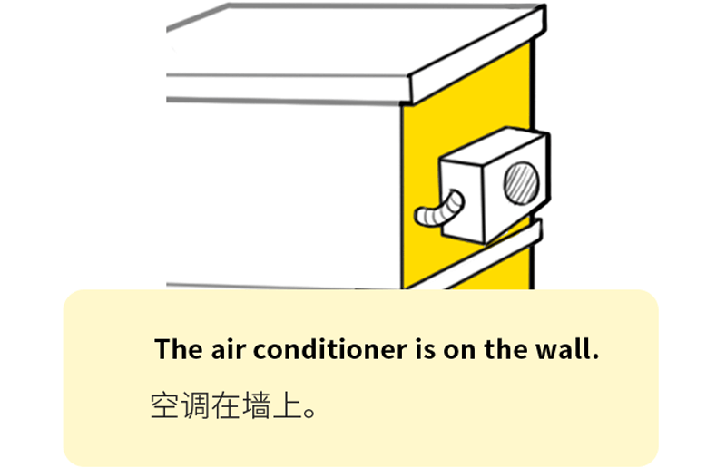

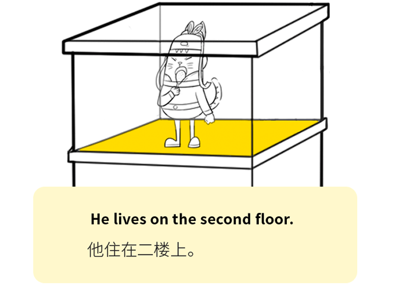

```
( floor有地板的意思，住在第二层地板上。 )
```

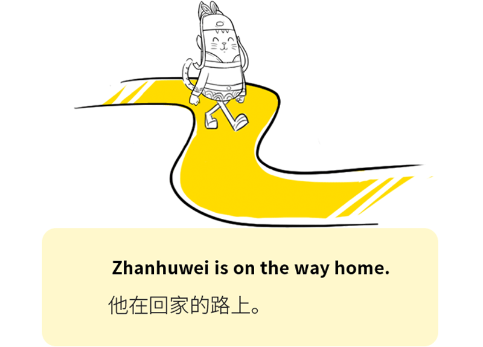

```
( 在路面上走。 )
```

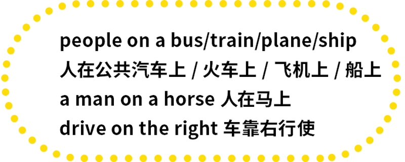

```
on强调事物在其表面上。
```

## At


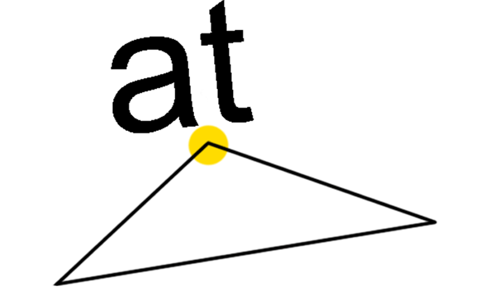

```
at把位置当作一个“点”
```

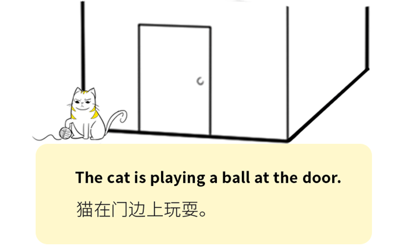


```
(斩护卫是大学里面的一员。)
```

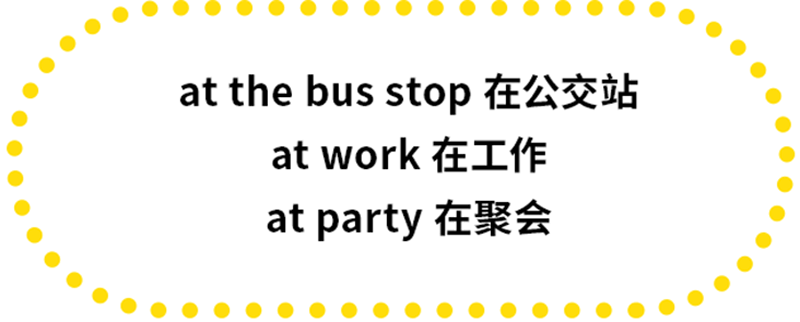

```
at强调把事物看成一个点。
```

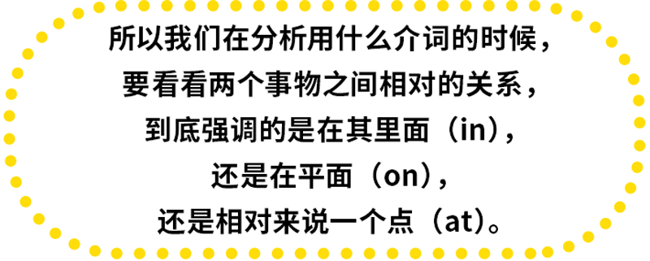

```
今天的内容， 看似简单， 但需要大家静下心来好好理解喔！
```

