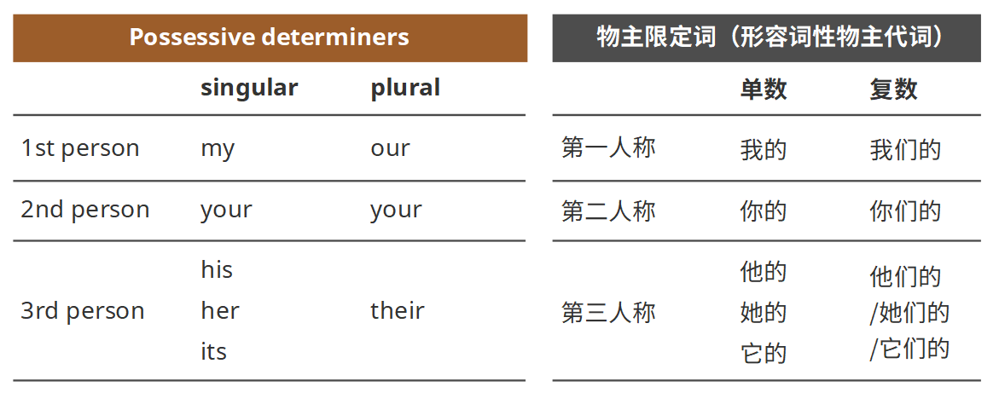
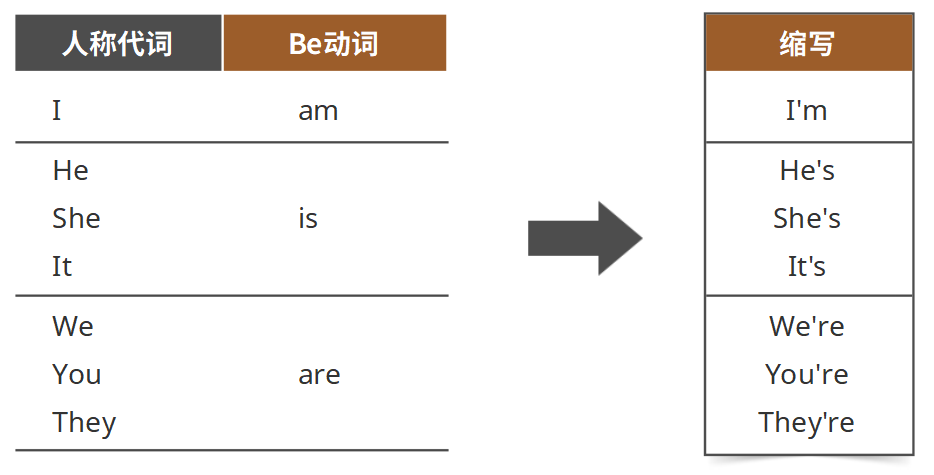
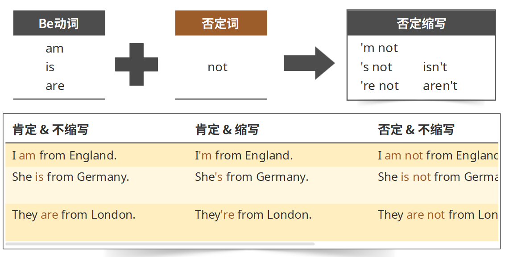
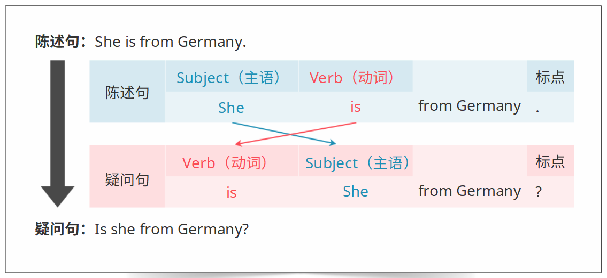
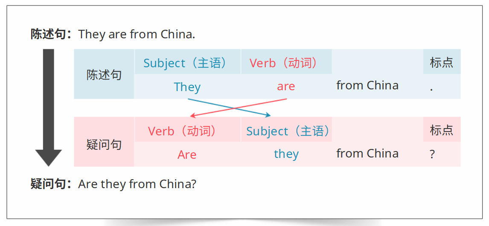
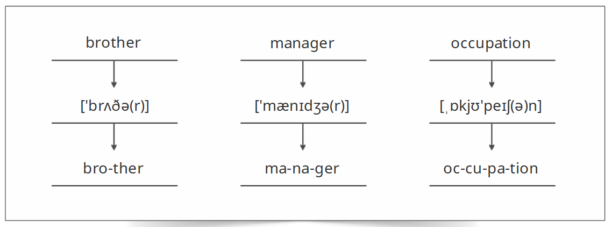

`学习目标`

> Understand key vocabulary about family,  jobs and nations
>
> 理解关于家庭、工作与国家的词汇 

> Understand nouns, personal pronouns, possessive determiners and the verb be
>
> 理解名词、人称代词、物主限定词与be动词 

> Pronounce syllable stress correctly
>
> 正确发出音节重音

### key vocabulary about family,  jobs and nations

#### key vocabulary

mother ['mʌðə] n. 母亲；妈妈 

father ['fɑːðə]n. 父亲；爸爸

daughter ['dɔːtə]n. 女儿 

son [sʌn]n. 儿子

sister ['sɪstə]n. 姐；妹(elder/younger)

brother ['brʌðə]n. （同父母的）兄，弟(elder/younger)

grandmother ['ɡrændˌmʌðə]n. 奶奶；外婆；（外）祖母

grandfather ['ɡrændˌfɑːðə]n. 爷爷；外公；（外）祖父

aunt [ɑːnt]n. 姑母；姨母；伯母；舅母

uncle ['ʌŋkəl]n. 叔父；伯父；伯伯；舅父 

#### jobs

farmer ['fɑːmə]n. 农场主；农人

teacher ['tiːtʃə]n. 教师；老师

scientist ['saɪəntɪst]n. 科学家

doctor ['dɒktə]n. 医生；大夫

writer ['raɪtə]n. 作家；作者

journalist ['dʒɜːnəlɪst]n. 新闻记者

businessman ['bɪznɪsˌmæn] n. 商界能手(男)

businesswoman ['bɪznɪsˌwʊmən] n. 商界能手(女)

sportsman ['spɔːtsmən]n. 运动员 (男)

sportswoman ['spɔːtsˌwʊmən]n. 运动员 (女)

basketball player['bɑːskɪtˌbɔːl 'pleɪə]篮球运动员

artist ['ɑːtɪst]n. 艺术家；（尤指）画家；专业演员；艺人 

singer ['sɪŋə]n. 歌手；歌唱家

dancer ['dɑːnsə]n. 舞蹈演员；跳舞者

#### country

> Asia

China ['tʃaɪnə]中国

Japan [dʒə'pæn]日本

Turkey ['tɜːkɪ]土耳其

South Korea [saʊθ kə'rɪə]韩国

India ['ɪndɪə]印度

> Europe

the United Kingdom[ðə juː'naɪtɪd 'kɪŋdəm]英国

France [frɑːns]法国

Spain [speɪn]西班牙

Germany ['dʒɜːməni]德国

Italy ['ɪtəlɪ]意大利

> Americas

the United States[ðə juː'naɪtɪd steɪts]美国

Mexico ['mɛksɪˌkəʊ]墨西哥

Argentina [ˌɑ:dʒənˈti:nə]阿根廷

Canada ['kænədə]加拿大

Brazil [brə'zɪl]巴西

> Oceania

Australia [ɒ'streɪlɪə]澳大利亚

New Zealand [njuː 'zi:lənd]新西兰

> Africa

Egypt ['i:dʒɪpt]埃及

South Africa [saʊθ 'æfrɪkə]南非

### nouns, personal pronouns, possessive determiners and the verb be

#### Nouns Verbs

> Nouns: words for people, places or things.
>
> 名词：表示人、地点或事物名称的词汇。 

> Verbs: words for states or actions. 
>
> 动词：表示动作或状态的词汇。 

#### Singular Plural

> Nouns = singular nouns + plural nouns
>
> 名词 = 单数名词 + 复数名词 

> Singular = 1 
>
> 单数 = 1 

> Plural > 1 
>
> 复数 > 1 

> We use -s at the end of plural nouns. 
>
> 我们在复数名词的最后加上s。

#### Personal pronouns

> We use personal pronouns before a verb.
>
> 我们把人称代词放在动词之前。

> The pronouns he, she, it, and they can also replace nouns.
>
> 人称代词he，she，it和they可替换名词。

#### Possessive determiners

> We use possessive determiners before a noun. 
>
> 我们把物主限定词放在名词之前。

#### the verb be

> The verb be has three present forms: am, is and are. 
>
> Be动词在一般现在时态中有三种形态：am，is和are。 

> We add not to make the negative.
>
> 我们加上not这个词来进行否定。

> The verb is before the subject in questions.
>
> 在疑问句中，动词出现在主语之前。

###  syllable stress

> Syllable: any of the units into which a word is divided, containing a vowel sound and usually one or more consonants.
>
> 音节：一个单词的一部分，其中包含一个元音和若干个辅音。 

> When a word has more than one syllable, one syllable in the word has more stress than the others. We say it in a longer, louder way than the other syllables. 
>
> 当一个单词有多个音节的时候，会强调其中一个音节的发音。我们在发这个音节的时候，会比其他音节的发音更长、更响亮。

### 小结

