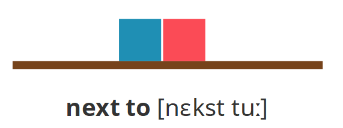
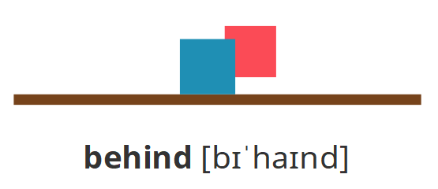
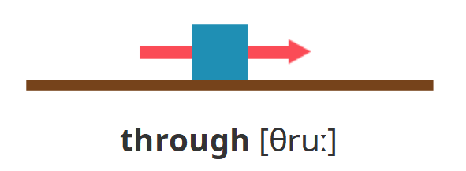
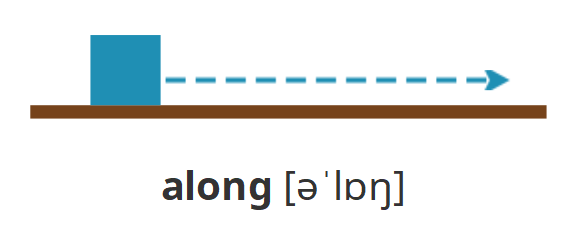
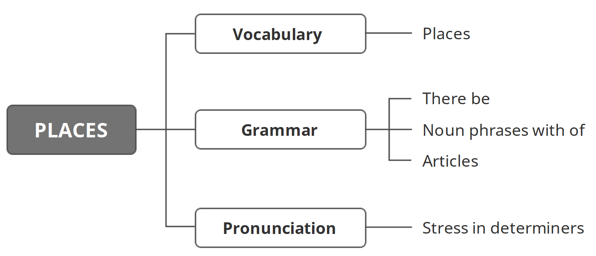

学习目标

> Understand key vocabulary about places
>
> 理解关于地点的词汇 

> Understand there be, noun phrases with of and articles
>
> 理解there be结构、of所有格与冠词

> Pronounce stress in determiners correctly
>
> 正确发出限定词重音

### Key vocabulary: places

#### Places in a city

train station[treɪn ˈsteɪʃən]火车站

factory[ˈfæktərɪ]n. 工厂

bank[bæŋk]n. 银行

bridge[brɪdʒ]n. 桥

museum[mjuːˈzɪəm]n. 博物馆

monument[ˈmɒnjʊmənt]n. 纪念碑

university[ˌjuːnɪˈvɜːsɪtɪ]n. 大学

library[ˈlaɪbrərɪ]n. 图书馆

park[pɑːk]n. 公园

fountain[ˈfaʊntɪn]n. 喷泉

#### Places in a country

sea [siː]n. 海；海洋

beach [biːtʃ]n. 沙滩

cliff [klɪf]n. 悬崖，峭壁

field [fiːld]n. 田地；田野

valley [ˈvælɪ]n. 山谷

farm [fɑːm]n. 农场；养殖场；农舍

forest [ˈfɒrɪst]n. 森林；林区

hill [hɪl]n. 山丘；小山

desert [ˈdɛzət]desert [ˈdɛzət]

mountain [ˈmaʊntɪn]mountain [ˈmaʊntɪn]

#### Prepositions of place

> on [ɒn]
>
> 在......上（互相接触）
>
> The building is on Shanghai street.

> over [ˈəʊvə]
>
> 悬在......上面
>
> The bridge is over the river. He walks over the bridge to his university.

> next to [nɛkst tuː]
>
> 紧邻；在......近旁
>
> The train station is next to the museum.

> behind [bɪˈhaɪnd]
>
> 在（或向）......的后面
>
> The fountain is behind the trees.

> through [θruː]
>
> 穿过；贯穿
>
> You should walk through that garden.

> near [nɪə]在......附近
>
> The factory is near the monument.

> along [əˈlɒŋ]沿着；顺着
>
> She walks along that road to the park.

> opposite [ˈɒpəzɪt]与......相对；在......对面
>
> The library is opposite the bank.

### Key grammar: there be, noun phrases with of and articles

#### There be

> Use There is ... (There's ... ) / There are ... (There're ... ) to talk about things you can see. 
>
> We use there is / there are to say that something exists.
>
> 用There is ...（There's ...）或There are ...（There're ...）结构来谈论看得见的事物。 
>
> 我们用there is或there are来表达某样事物的存在。

#### Noun phrases with of

> One type of noun phrase is a noun + of + a noun.
>
> 名词短语的一种形式是：名词+of+名词

#### Articles

> We use articles before a noun or before an adjective + noun. 
>
> There are four articles: a, an, the and the zero article.
>
> 我们在名词或者形容词与名词构成的名词短语前使用冠词。 
>
> 冠词有四种：a，an，the以及零冠词。

`可数名词&不可数名词`

> 能以确切数量来计算的名词，称为“可数名词”，例如：book，boy，phone；不能以确切数量来计算的叫“不可数名词”，例如：rice，water，hair，sand，milk，meat，love。
>
> We use the before the names of rivers, seas, oceans, many famous places, 'united' countries, groups of islands and groups of mountains.
>
> 我们在下列名称之前使用the：河流，海洋，名胜，“联合”国家，群岛以及山脉。

> We use no article (the zero article) before the names of continents, countries and cities.
>
> 我们在下列名称之前使用零冠词（即不加冠词）：大洲，国家以及城市。

`冠词规律一览`

• 单数可数名词前用a或者an 

• 不可数名词前不能加a/an 

• 可数名词、不可数名词前都可加the表示特指（某个事物或者已经提到过的事物） 

• 山河湖海岛+名胜+联合国家前加the 

• 大洲国家城市前不加the 

#### The imperative

> Use the imperative to give instructions and directions. 
>
> There is usually no pronoun in the imperative.
>
> 在给出说明和指引的时候，使用祈使句。 
>
> 在祈使句中通常没有代词。

### Correct Pronunciation: stress in determiners

> Stress the words 
>
> • this, these and here to point to things
>
>    that are near. 
>
> • that, those and there to point to things
>
>    that are not near.
>
> 重读： 
>
> • this、these和here指向近距离事物的
>
>    词汇。 
>
> • that、those和there这些指向远距离
>
>    事物的词汇。

### 总结

