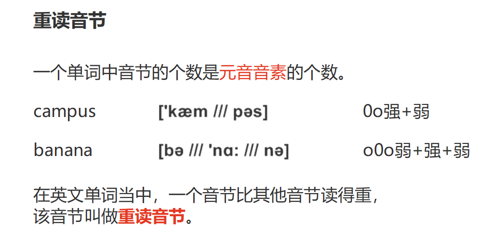
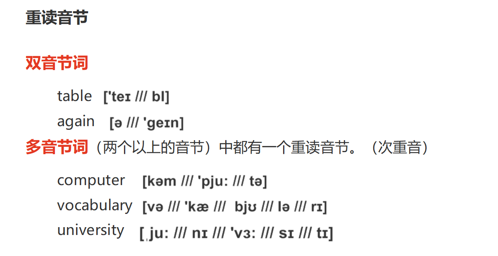

# 01

## [I] VS [i]

`[I]`：''yi ei'' **i**/短元音

`[i]`：''yi...'' **ee/ea**/长元音

## [P] vs [b]

`[P]`：''pe'' **p/pp** `happy`/清辅音

`[b]`：''be'' **b/bb** `rubber`/浊辅音

# 02

## [ʊ]vs[u:]

`[ʊ]`："wu" **oo/ou** `look` `could`/短元音

`[u:]`："wu..." **oo/ou/oe/ue** `zoo` `route`/长元音

## [t]vs[d]

`[t]`："te" **t/tt** `water` `butter`/清辅音

`[d]`："en.de" **d/dd/tt** `food` `middle`/浊辅音

# 03

## [ʌ]vs[ɑ:]

`[ʌ]`："a" **u/o/ou** `cup` `bus` `come` `touch`/短元音

`[ɑ:]`："a.." **a/ar** `half` `hard` `card`/长元音

## [k]vs[g]

`[k]`："ke" **c/k/ck/ch** `pick` `crow` `stomach`/清辅音

`[g]`："ge" **g/gg** `go` `glad` `bigger`/浊辅音

# 04

## [ɒ]vs[ɔ:]

`[ɒ]`："o" **o/a** `Oxford` `copy` `watch`/短元音

`[ɔ:]`："o..." **a/ar/ough** `call` `warm` `bought`/长元音

## [f]vs[v]

`[f]`："fu" **f/ff/ph/gh** `leaf` `office` `photo` `laugh`/清辅音

`[v]`："vu.." **v** `vote` `visit`/浊辅音

# 05

## [e]vs[æ]

`[e]`："ei" **e/a/ea/ai** `set` `many` `bread` `said`/短元音

`[æ]`："ea" **a** `map` `hand`/长元音

## [θ]vs[ð]

`[θ]`： **th** `thank` `south` `thirty`/清辅音

`[ð]`： **th** `then` `they` `mother` `father`/浊辅音

**音节**

一盒单词可以划分成1个或多个音节。

音节由一个或多个音素构成，而且每个音节必须包含**一个元音音素**。

有一些音节，只有一个元音音素构成，常见于**双元音**。

`元音`+ `(辅音)`  `自由搭配`

see  [si:]  辅音[s] + 元音[i:]

if      [If]    元音[I] + 辅音[f]

tip   [tIp]  辅音[t] + 元音[I]  +  辅音[P]

# 07

## [ə]vs[ɜ:]

`[ə]`："e" **a/o/u/e** `ago` `campus` `mother`/短元音

`[ɜ:]`："e.." **o/u/e** `worse` `lurk` `service`/长元音

## [s]vs[z]

`[s]`："si" **s/c** `bus` `city` `miss`/清辅音

`[z]`："ri" **s/z** `noise` `zoo` `scissors` `jazz`/浊辅音

## [ʃ]vs[ʒ]

`[ʃ]`："she" **sh** `shop` `lash` `wash`/清辅音

`[ʒ]`："decision" **s/si** `vision` `television`/浊辅音

# 08

## [ɪə]vs[eə]

`[ɪə]`："yi e" **ea/ee** `hear` `beer`/双元音

`[eə]`："ei e" **ai/ea/ere** `fair` `wear` `where`/双元音

## [aɪ]vs[eɪ]

`[aɪ]`："ai" **igh/uy/ie** `tide` `fly` `high` `buy` `tie`/双元音

`[eɪ]`："ei" **ai/ay/ea/eigh/ey** `table` `say` `say` `great` `eight` `hey`/双元音

## [ɒɪ]vs[ʊə]

`[ɒɪ]`："o yi" **oi/oy** `soil` `toy`/双元音

`[ʊə]`："wu e" **oor/our** `poor` `tour`/双元音

## [aʊ]vs[əʊ]

`[aʊ]`："a wu" **ow/ou** `down` `ground` `mouth`/双元音

`[əʊ]`："e wu" **o/ow/oa** `no` `low` `boat`/双元音

开音节/闭音节**

26个字母中：

元音字母：a, e, i, o, u

辅音字母：其他

**开音节**

(1)以发音的元音字母结尾的音节。

be, he, so, also, photo

(2)以辅音字母(r除外) + 不发音的e结尾的音节。

date, make, like;

在重读的开音节中元音字母按字母名称读音。

**闭音节**

以一个或几个辅音字母(r除外)结尾

而中间只有一个元音字母的音节，称为闭音节。

tip, is, desk, drink;
